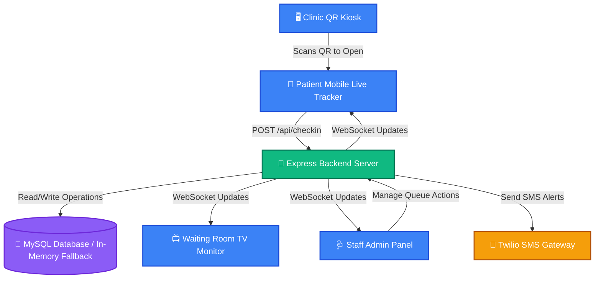

# 🏥 QueueCare | Patient Queue Management System

QueueCare is a premium, real-time patient queue management system designed to eliminate waiting room congestion and enhance patient comfort. Patients scan a QR code at the clinic kiosk, check in on their mobile phones, track their live slot dynamically, and receive automated SMS updates when their turn is near.

Staff members have role-based accounts (Doctors and Receptionists) with access-controlled dashboards tailored to their daily clinical workflows.

---

## 🌟 Key Features

### 1. 📋 Multi-Department Queuing
* Supports separate, isolated queues for clinic departments: **General Medicine**, **Cardiology**, **Pediatrics**, and **Dermatology**.
* Real-time wait calculations (`15 mins * peopleAhead`) run independently for each department's active queue.

### 2. 🎟️ Digital Ticket Stub (Patient Tracker)
* A mobile-first live status tracker styled as a physical ticket stub with styled tear lines, side notches, and dynamic contrast barcodes.
* Live WebSocket connection displays queue positions ahead of the patient and estimated wait times in real-time.
* A client-side cached **Dark/Light theme toggle** stores preferences in `localStorage` to avoid hydration flickering.

### 3. 📺 Waiting Room TV Monitor
* Dedicated large-screen display showing the patient currently being served and the "Up Next" queue list.
* Displays a dynamic registration QR code linking directly to the check-in page.
* Real-time **dual-tone chime notifications** synthesized directly using browser-native Web Audio `AudioContext` (avoiding heavy audio asset downloads).
* Full-screen flash alerts trigger dynamically when a new patient is called.

### 4. 🔐 Role-Based Access Control (RBAC)
Dedicated dashboard views for different clinic staff:
* **Doctor**:
  * Authorized to call next patients and complete consultation sessions.
  * Features the **Clinic Analytics** tab powered by Chart.js (displaying today's hourly check-in volume trends and wait times per department).
  * Auto-hides the walk-in registration form to keep the medical panel clean.
* **Receptionist**:
  * Authorized to register walk-in patients and adjust queue ordering (Delay/Cancel).
  * Automatically blocks access to, and hides, the call controllers and analytics logs.

### 5. ⏰ Auto-Skip Stale No-Shows
* A background server worker runs every 30 seconds to detect patients in `SERVING` status.
* If a patient has been called but doesn't show up within the timeout window (configurable, default 2 mins for demo), the server auto-cancels their ticket, notifies the client via WebSockets, and reorders the queue.

---

## 🏗️ System Architecture



---

## 🛠️ Technology Stack

* **Frontend**: Next.js (App Router), Vanilla CSS Custom Properties, HSL color tokens, Socket.io-client, Lucide icons, Chart.js, QRCode.
* **Backend**: Node.js, Express, Socket.io (WebSocket announcements), mysql2 (relational MySQL client).
* **SMS Gateway**: Twilio API.

---

## 🚀 Installation & Local Setup

### 1. Configure Environments
Create a `.env` file inside the `backend/` directory:
```env
PORT=5000
DB_HOST=localhost
DB_PORT=3306
DB_USER=root
DB_PASSWORD=
DB_NAME=queuecare

# JWT secret for RBAC authentication sessions
JWT_SECRET=queuecare_super_secret_session_key

# Twilio SMS API Credentials (Optional: falls back to console logger if empty)
TWILIO_ACCOUNT_SID=your_account_sid
TWILIO_AUTH_TOKEN=your_auth_token
TWILIO_PHONE_NUMBER=your_twilio_phone
```

Create a `.env.local` file inside the `frontend/` directory:
```env
NEXT_PUBLIC_BACKEND_URL=http://localhost:5000
```

---

### 2. Run the Backend Server
```bash
cd backend
npm install
npm run dev
```
*Note: The backend will automatically connect to your MySQL database, run auto-migrations to create the `patients` and `staff` tables, and seed the demo dataset. If MySQL is unreachable, it automatically triggers an **In-Memory fallback database** so you can test all features instantly offline.*

---

### 3. Run the Frontend Client
```bash
cd frontend
npm install
npm run dev
```
Open **[http://localhost:3000](http://localhost:3000)** in your browser!
