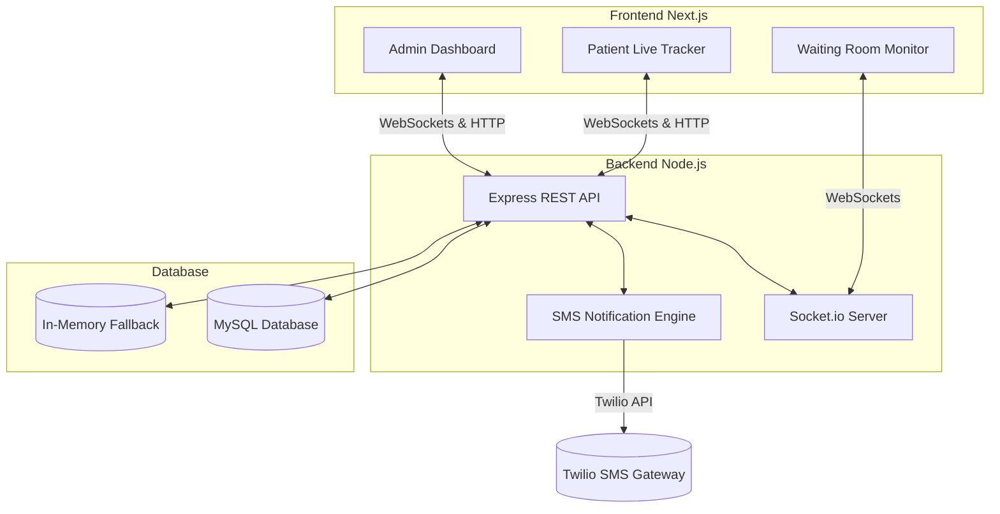

# Implementation Plan: Patient Queue Management System (QueueCare)

QueueCare is a real-time patient queue management system designed to reduce wait-time anxiety in clinics. It lets patients check in, track their queue position live from their phones, and receive automated SMS notifications when their turn is near.

---

## User Review Required

> [!IMPORTANT]
> **Database & SMS Out-of-the-Box Fallbacks**
> * **MySQL Fallback**: If MySQL env vars are not set or connection fails, the backend will automatically fall back to an In-Memory Database (with automated mock data seeding) so the system runs immediately for testing.
> * **Twilio Fallback**: If Twilio credentials are not provided, SMS messages will be logged to the server console with a stylized debug panel, allowing local testing without a Twilio account.
> Please let me know if you would like me to configure a strict SQLite file-based fallback or stick to MySQL + In-Memory.

---

## Architecture Design

We will set up a monorepo structure with:
1. `backend/`: Node.js, Express, Socket.io, `mysql2`, `dotenv`, and `twilio`.
2. `frontend/`: Next.js (App Router), Vanilla CSS / CSS Modules, Socket.io-client.



---

## Database Schema (MySQL)

We will define a table named `patients` to track queue positions and statuses.

```sql
CREATE TABLE IF NOT EXISTS patients (
    id INT AUTO_INCREMENT PRIMARY KEY,
    name VARCHAR(255) NOT NULL,
    phone VARCHAR(20) NOT NULL,
    status ENUM('WAITING', 'PRE_CALL', 'SERVING', 'COMPLETED', 'CANCELLED') DEFAULT 'WAITING',
    position INT NOT NULL, -- Current queue order index (1, 2, 3...)
    created_at TIMESTAMP DEFAULT CURRENT_TIMESTAMP,
    updated_at TIMESTAMP DEFAULT CURRENT_TIMESTAMP ON UPDATE CURRENT_TIMESTAMP,
    called_at TIMESTAMP NULL,
    sms_sent_pre_call BOOLEAN DEFAULT FALSE,
    sms_sent_called BOOLEAN DEFAULT FALSE
);
```

---

## SMS Notification Rules
1. **Upon Check-in**: SMS sent confirming queue position and estimated wait time (e.g., *15 mins per patient*).
2. **Turn Approaching (Pre-Call)**: When a patient reaches position #3 (2 people ahead), trigger an automated notification: *"Your turn is near! There are 2 people ahead of you. Please head to the clinic reception."*
3. **Now Serving (Called)**: When the staff clicks "Call Next", the patient receives: *"It is your turn! Please proceed to Counter/Room 1."*

---

## Proposed Changes

### 1. Backend Service (`/backend`)

#### [NEW] [package.json](file:///c:/Users/arunb/Downloads/QueueCare/backend/package.json)
Contains backend dependencies: `express`, `socket.io`, `mysql2`, `twilio`, `dotenv`, `cors`.

#### [NEW] [server.js](file:///c:/Users/arunb/Downloads/QueueCare/backend/server.js)
Bootstrap Express, HTTP Server, Socket.io, and start listening on port `5000`.

#### [NEW] [db.js](file:///c:/Users/arunb/Downloads/QueueCare/backend/db.js)
Handles MySQL connection. If MySQL connection parameters are missing or fail, it initializes a high-performance in-memory mock repository with pre-seeded data so developers can play with the application immediately.

#### [NEW] [twilio.js](file:///c:/Users/arunb/Downloads/QueueCare/backend/twilio.js)
Twilio Client configuration. Sends SMS. If credentials are missing, logs messages in a clean console layout.

#### [NEW] [routes.js](file:///c:/Users/arunb/Downloads/QueueCare/backend/routes.js)
API endpoints:
- `POST /api/checkin` (Register new patient)
- `GET /api/queue` (Get current active queue)
- `POST /api/queue/call` (Call next patient - updates status, emits ws event, sends SMS)
- `POST /api/queue/complete/:id` (Complete check-in)
- `POST /api/queue/cancel/:id` (Remove patient from queue)
- `POST /api/queue/delay/:id` (Snooze patient - moves them back 1-2 positions)

---

### 2. Frontend Next.js Client (`/frontend`)

#### [NEW] [package.json](file:///c:/Users/arunb/Downloads/QueueCare/frontend/package.json)
Standard Next.js configuration.

#### [NEW] [next.config.mjs](file:///c:/Users/arunb/Downloads/QueueCare/frontend/next.config.mjs)
Configures routing proxies if needed.

#### [NEW] [global.css](file:///c:/Users/arunb/Downloads/QueueCare/frontend/src/app/global.css)
Defines CSS custom properties (color tokens, fonts, animations, layout utilities). Features a premium glassmorphic dark/light theme, Outfit & Inter fonts, and customized animations.

#### [NEW] [layout.js](file:///c:/Users/arunb/Downloads/QueueCare/frontend/src/app/layout.js)
Configures global fonts and page structure.

#### [NEW] [page.js](file:///c:/Users/arunb/Downloads/QueueCare/frontend/src/app/page.js)
**Patient Self-Checkin Web Page**: Sleek form with live preview. After submission, redirects to the tracker.

#### [NEW] [tracker.js](file:///c:/Users/arunb/Downloads/QueueCare/frontend/src/app/tracker/[id]/page.js)
**Real-Time Queue Tracker**: Shows position, estimated time, real-time WebSocket pulses, and interactive status cards.

#### [NEW] [admin.js](file:///c:/Users/arunb/Downloads/QueueCare/frontend/src/app/admin/page.js)
**Clinic Dashboard**: Complete dashboard for managing the queue.
- Real-time queue view with quick actions (Call, Delay, Cancel, Complete).
- Key metrics: Average Wait Time, Total Checked In, Completed, Cancellations.
- Manual patient registration drawer.

#### [NEW] [monitor.js](file:///c:/Users/arunb/Downloads/QueueCare/frontend/src/app/monitor/page.js)
**Waiting Room TV Display**: Fullscreen, large-card layout showing "Now Serving" and "Next Up". Synthesizes WebSocket events into slide-in text transitions and soft chime noises (optional/visual cues).

---

## Verification Plan

### Automated Tests
* We can run `npm run test` or check console behavior when mock data is in play.
* Validate endpoint HTTP responses using curl or node scripts.

### Manual Verification (Browser Subagent)
* We will use the browser subagent to:
  1. Open the Admin Dashboard.
  2. Open a separate window for the Public Monitor.
  3. Open a separate window for the Patient Checkin.
  4. Submit a patient check-in form.
  5. Verify the patient immediately appears on the Admin Dashboard and the TV Monitor (via Socket.io).
  6. Click "Call Next" in Admin, verify that the Public Monitor updates with an animation, the Patient Tracker changes status, and the backend logs an SMS notification dispatch.
